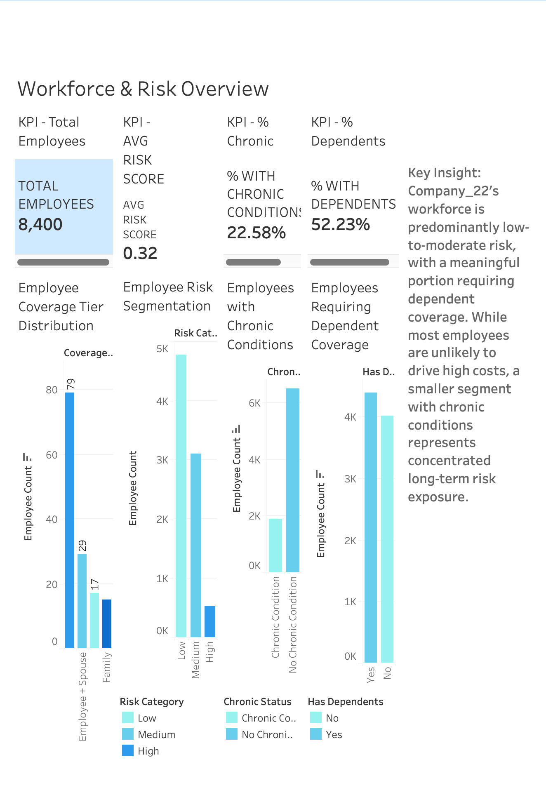
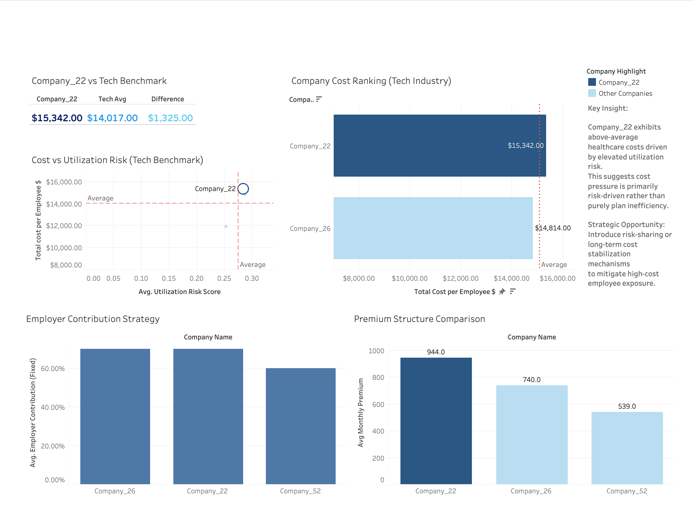

# Healthcare Benefits Cost Optimization Analysis

## Overview
This project is an end-to-end data analysis of employer-sponsored healthcare benefits, designed to evaluate cost efficiency, employee utilization patterns, and strategic opportunities for benefits optimization.

The analysis simulates a real-world scenario where a company (Company_22 in the Technology sector) is seeking to balance employee satisfaction with rising healthcare costs.

---

## Objective
To develop a data-driven benefits strategy that improves cost efficiency while maintaining comprehensive and competitive healthcare coverage.

---

## Project Structure

### 1. Workforce Profile Analysis
- Analyzed employee demographics, coverage tiers, and risk segmentation
- Identified high-risk vs low-risk population groups

### 2. Industry Benchmarking
- Compared Company_22 against Technology sector peers
- Evaluated premiums, employer contributions, and cost efficiency
- Identified a gap between high employer investment and low utilization

### 3. Claims & Utilization Analysis
- Analyzed healthcare claims distribution and cost drivers
- Identified cost concentration among a small subset of employees
- Evaluated impact of chronic conditions and dependent coverage

### 4. Strategic Recommendation
- Developed a targeted benefits optimization strategy
- Focused on cost efficiency without reducing employee experience
- Introduced concepts such as:
  - Risk-based cost management
  - HSA optimization
  - Long-term behavioral incentives

---

## Key Insights

- Healthcare costs are highly concentrated among a small subset of employees
- Company_22 demonstrates higher employer spending with lower-than-expected utilization
- Traditional cost-cutting strategies are ineffective due to cost concentration dynamics
- Strategic alignment of incentives and targeted interventions provides the greatest opportunity for optimization

---

## Tools & Technologies

- Python (Pandas, NumPy)
- Data Visualization (Matplotlib, Seaborn)
- Jupyter Notebook (via Google Colab)
- GitHub (project versioning and reproducibility)

---

## Data

This project uses **synthetic datasets** created to simulate:
- Employer health plans
- Employee demographics and risk profiles
- Healthcare claims and utilization patterns

---

## 📊 Tableau Dashboards

### Workforce & Risk Overview — Company_22

This dashboard analyzes workforce composition, dependent coverage trends, and utilization risk distribution to understand the underlying drivers of healthcare demand.

---

### Healthcare Cost & Risk Strategy — Technology Industry Benchmark

This dashboard benchmarks Company_22 against peer organizations in the Technology sector, highlighting cost positioning, utilization risk, and strategic opportunities for cost optimization.

---

### 🔗 Interactive Dashboard

View the full interactive version on Tableau Public:  
[***]

## Key Takeaway

This analysis demonstrates that optimizing healthcare benefits is not about reducing coverage, but about aligning cost structures with actual utilization patterns through targeted strategies and long-term incentive design.

---

## Author

Oluwaseyi Adewuya  
